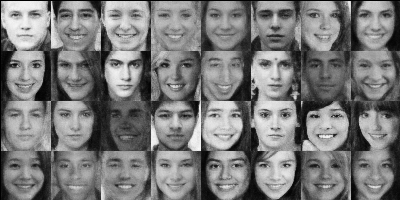
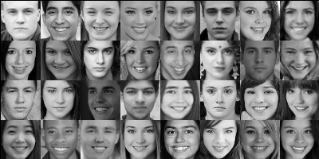

# Conditional Smiles! (SmileCVAE)

## About
Implementation of CVAE. Trained CVAE on faces from  [UTKFace Dataset](https://susanqq.github.io/UTKFace/). With an (handmade) encoding of the Smile-strength degree to produce conditional generation of synthetic faces with a given smile degree.

## Installation
1. Clone the repository ``` git clone https://github.com/raulorteg/SmileCVAE```
2. Create virtual environment:
* Update pip ``` python -m pip install pip --upgrade ```
* Install ``` virtualenv ``` using pip ``` python -m pip install virtualenv ```
* Create Virtual environment ``` virtualenv SmileCVAE ```
* Activate Virtual environment (Mac OS/Linux: ``` source SmileCVAE/bin/activate ```, Windows: ``` SmileCVAE\Scripts\activate ```)
* (_Note: to deactivate environemt run ``` deactivate ```_)
3. Install requirements on the Virtual environment ``` python -m pip install -r requirements.txt ```

## Results




## Play with it
See the ```Example/example.ipynb ```, play with the encoding value to produce new synthetic faces with the desired smile degree. 

## The Dataset
The images of the faces come from [UTKFace Dataset](https://susanqq.github.io/UTKFace/). However the images do not have any encoding of a continuous degree of "smiley-ness". This "smile-strength" degree is produced by creating a slideshow of the images and exposing them to three subjects (me and a couple friends), by registering wheather the face was classified as smiley or non-smiley we encourage the subjects to answer as fast as possible so as to rely on first impression and the reaction time is registered.


