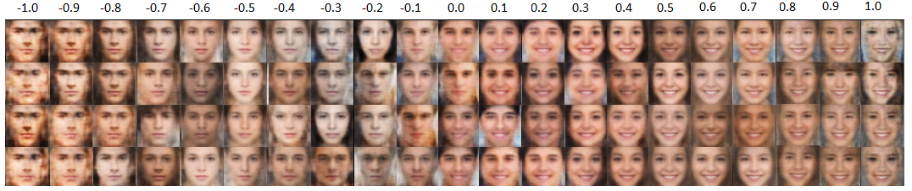
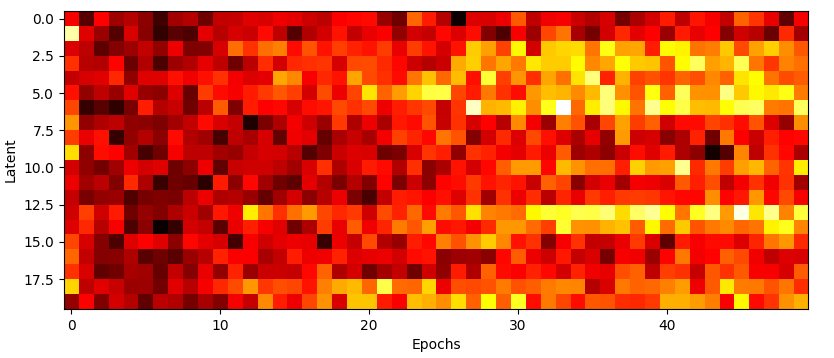
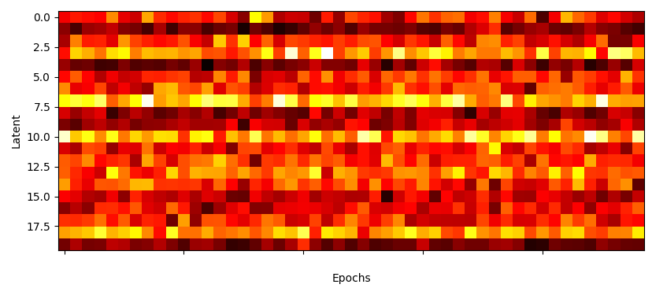
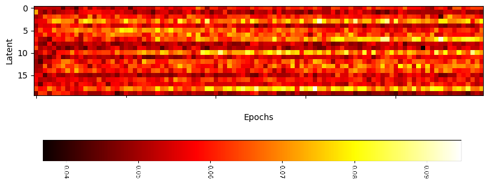
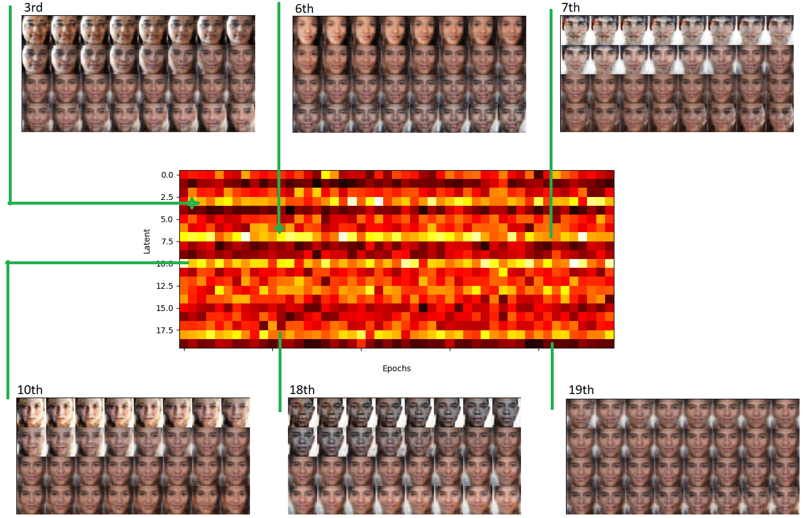
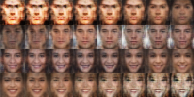
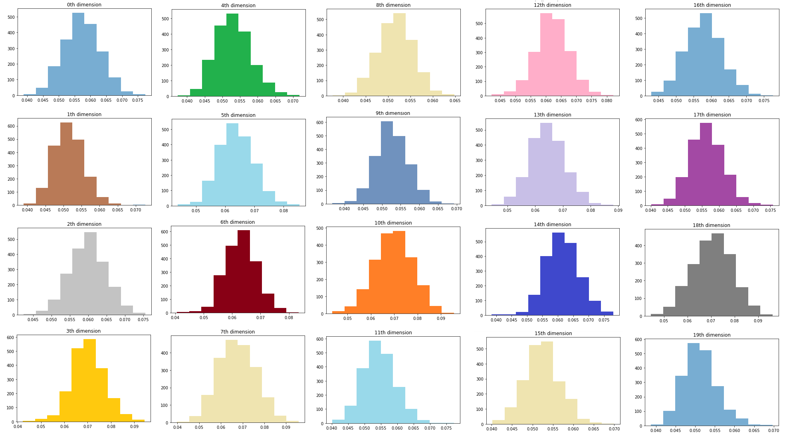
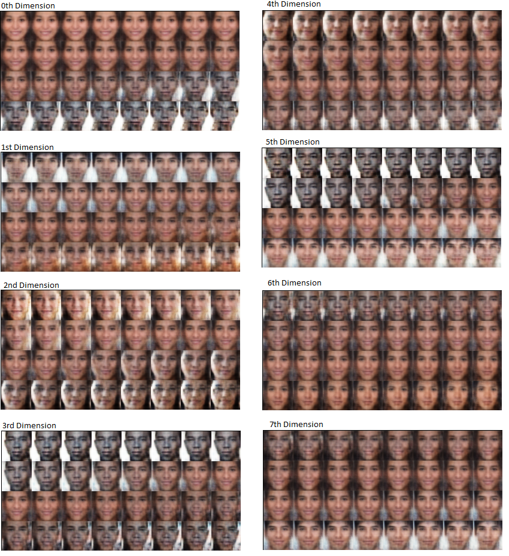
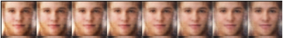

# Conditional Smiles! (SmileCVAE)

## About
Implementation of AE, VAE and CVAE. Trained CVAE on faces from  [UTKFace Dataset](https://susanqq.github.io/UTKFace/). With an (handmade) encoding of the Smile-strength degree to produce conditional generation of synthetic faces with a given smile degree. The project has two implementations, one using the images in the dataset in Grayscale and other using the images in the dataset in RGB. The former Grayscale implementation can be found under ```black_and_white/```

## Installation
1. Clone the repository ``` git clone https://github.com/raulorteg/SmileCVAE```
2. Create virtual environment:
* Update pip ``` python -m pip install pip --upgrade ```
* Install ``` virtualenv ``` using pip ``` python -m pip install virtualenv ```
* Create Virtual environment ``` virtualenv SmileCVAE ```
* Activate Virtual environment (Mac OS/Linux: ``` source SmileCVAE/bin/activate ```, Windows: ``` SmileCVAE\Scripts\activate ```)
* (_Note: to deactivate environemt run ``` deactivate ```_)
3. Install requirements on the Virtual environment ``` python -m pip install -r requirements.txt ```
4. Create the directory structure ``` python setup_directories.py ```

## Usage
### With shell scripts files:
_Note: Shell scripts are created to easily train and obtain visualizations, to run everything:_ 
1. Navigate to ```cd scripts/pc```
2. To run all scripts ``` sh run_all.sh```

### Manually
1. Train the models (e.g ``` python cvae.py --n_epochs=1000 --lr=0.00002 --beta=0.5 --batch_size=8 --latent_size=20 --resize=50 ```)
2. Obtain synthetic samples from the latent space (e.g ``` python sample_prior.py --degree=0.6 --resize=50 --latent=20 ```)
3. Force smiles on people (e.g ``` python changing_smiles.py --degree=0.6 --resize=50 --latent=20 ```)
4. Inspect the axis-th dimension of the latent space (e.g ``` python sample_across_axis.py --axis=0 --resize=50 --latent=20 ```)

## Results
### Training
In the .gif below the reconstruction for a group of 32 faces from the dataset can be visualized for all epochs. For the Grayscale and RGB implementation.


Below, the final reconstruction of the CVAE for 32 faces of the dataset side by side to those original 32 images, for comparison. For the Grayscale and RGB implementation.

<p float="left">
  
   
</p>
<p float="left">
  
   
</p>

### Conditional generation
Using ```synthetic.py```, we can sample from the prior distribution of the CVAE, concatenate the vector with our desired ecnoding of the smile degree and let
the CVAE decode this sampled noise into a synthetic face of the desired smile degree. The range of smile-degree encodings in the training set is [-1,+1], where
+1 is most smiley, -1 is most non-smiley. Below side to side  64 synthetic images for encodings -0.5, +0.5 are shown produced with this method for the GrayScale implementation

<p float="left">
  
   
</p>

Below 4 images are sampled for every 0.1 increment in between [-1,1] for the RGB case, showcasing the synthetic image generation potential. Notice how the synthetic images are more varied for encodings around [-0.7,-0.5] and [0.5, 0.7]. Which is the region with highest counts of samples in the dataset.



## Forcing smiles
With the trained model, one can use the pictures from the training set and instead of feeding in the  smile-degree encode of the corresponding picture we can fix an encoding or shift it by a factor to force the image a smile/non smile. Below this is done for 32 picture of the training set, on the op the original 32 images are shown, below the reconstruction with their actual encoding, and then we shift the encoding by +0.5, +0.7, -0.5, -0.7 to change the smile degree in the original picture (zoom in to see in detail!). Finally the same diagram is now shown for a single picture.


## Probing the Latent Space
The RGB implementation used a latent space of dimension 20 and thus can't be directly represented. During training for every epoch the variance across every dimension is computed in an online approach using Welford's algorithm, this can be used to see which dimensions of the latent space are mostly used. In the plots below a heatmap is shown for the variance of the latent space across the first 50 epochs (left), last 50 epochs (right) and all training (bottom) by showing only one in every 20 epochs.
<p float="center">
  
  
  
</p>

Here we can see how the usage of the Latent space changes as the model learn to reconstruct the data. At the beggining it uses all the latent space but at the the end there are dimensions that are much more used than others, notice th horizontal white lines. Using this plot then we can sample the latent space uniformly across some given dimension. By fixing all other dimensions to value 0.0 and moving uniformly some dimension and decode the samples into images we can visualize what each component is doing, roughly. Since there are a lot of dimensions we can use the latent variance plot to select the most important ones and then using this method visualize their effect.



In the figure above some of the most important/active dimensions can be visualize and interpreted. Note the difference with the 19th dimension, displayed to show how a dimension with low variance when sampled doesn't change much te reconstruction. Finally, by proving the last dimension in the latent space, which is not shown in the plot because its the dimension concatenated before feeding the decoder, we reconstruct a continuum of the conditional variable. See image below, whcih should be read from left to right, from top to bottom.



Although there are a number of dimensions really active it might be the case that there is some correlation between them. By performing a forward pass on the training data and saving the latent representations of all the data we can then inspect further the latent space. By plotting a histogram of the values of every dimension we obtain the following graph:



Which as expected has gaussian shape for every dimension. One can also see perform PCA on the latent representation to find the principal components to explain all the variance on the data and then instead of decoding the images while varying a value along each of the original dimensions, we can decode images while moving in the each of the dimensions in the PCA transformed data, which are linear combinations of the original dimensions, in the hopes that in this representation of the latent space the "new" dimensions can be decoded into images whose variation is more easily interpretable. The results of this experiment can be found at ``` results/axis/pca_axis_*``` and the top 8 components can be seen in the figure below.



An interesting highlight, in the 12th transformed dimension the component seems to model something that looks like beard, see the figure below:




## The Dataset
The images of the faces come from [UTKFace Dataset](https://susanqq.github.io/UTKFace/). However the images do not have any encoding of a continuous degree of "smiley-ness". This "smile-strength" degree is produced by creating a slideshow of the images and exposing them to three subjects (me and a couple friends), by registering wheather the face was classified as smiley or non-smiley we encourage the subjects to answer as fast as possible so as to rely on first impression and the reaction time is registered.

## Notes: Bias in the Dataset
Its interesting to see that the when generating synthetic images with encodings < 0 (non-happy) the faces look more male-like and when generating synthetic images with encodings > 0 (happy) they tend to be more female-like. This is more apparent at the extremes, see the Note below. The original dataset although doesnt contains a smile degree encode, it has information of the image encoded in the filename, namely "gender" as boolean values. Using this information then I can go and see if there was a bias in the dataset. In the piechart below the distribution of gender, and smile are shown. From there we can see that that although there are equals amount of men and women in the dataset, there were more non-smiley men than smiley men, and the bias of the synthetic generation may come from this unbalance.


## Notes: Extending the encoding of smile-degree over the range for synthetic faces
Altough the range of smile-strength in the training set is [-1,+1], when generating synthetic images we can ask the model to generate outside of the range. But notice that then the synthetic faces become much more homogeneus (model collapse), more than 64 different people it looks like small variations of the same synthetic image. Below side to side  64 synthetic images for encodings -3 (super not happy), +3 (super happy) are shown produced with this method for the Grayscale case, and since the RGB case was found to be worse at extending the range the images shown for the RGB images correspond to -1.1 and 1.1.

<p float="center">
  
   
</p>
<p float="center">
  
   
</p>


## References:
* Kingma, Diederik & Welling, Max. (2013). Auto-Encoding Variational Bayes. ICLR. 
* Learning Structured Output Representation using Deep Conditional Generative Models, Kihyuk Sohn, Xinchen Yan, Honglak Lee
* Fagertun, J., Andersen, T., Hansen, T., & Paulsen, R. R. (2013). 3D gender recognition using cognitive modeling. In 2013 International Workshop on Biometrics and Forensics (IWBF) IEEE. https://doi.org/10.1109/IWBF.2013.6547324
